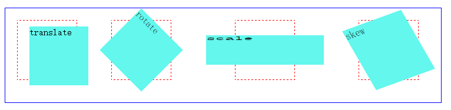
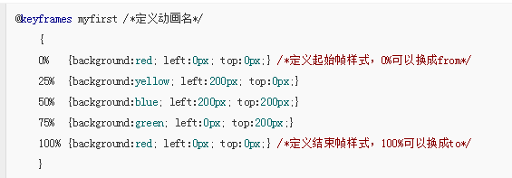
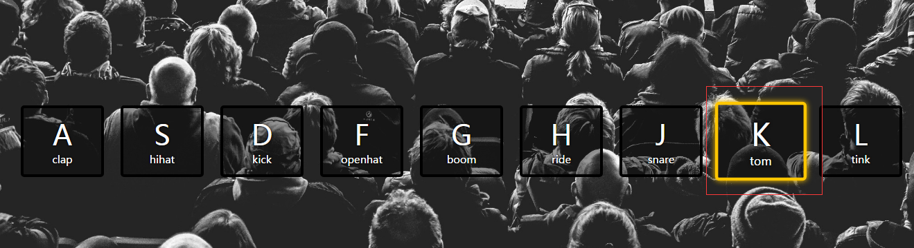

## JS Drum Kit 


### 像素定位rem px vh pt

### transition（渐变过渡），transform（变形），Animation（动画）
- transform：变形，基于元素中心，可以通过transform-origin，来改变变换的基点
  - rotate（角度）2D旋转
  - skew（x-angle,y-angle）沿着X和Y轴，倾斜一定的角度
  - scale（x,y）放大或者缩小元素的宽度和高度
  - translate（x,y）沿X和Y轴移动



- transition：允许css属性在一定的时间区间内平滑的过渡
  - 参数：要进行渐变的元素属性，过渡持续时间，渐变的速度（ease，linear等），延迟时间
  - css属性：width，height，transform，background，opacity，box-shadow，border-color都可以发生渐变过渡效果

- Animation：
  - 命名规则：@keyframes 动画名称 { }



  - animation:完成一个周期的时间，速度曲线，何时开始，播放的次数，是否循环播放，暂停或者播放

  `animation:myfirst 5s linear 2s infinite alternate;`
### `Array.from()`方法的使用

  - ES6增加的，将<span style='color:red;font-size:16px;font-weight:700'>其他对象转为数组</span>，返回一个新的数组实例
  - 其他对象：类数组对象（一个对象必须要有length属性，没有length属性，转出来是空数组）；部署了Iterator接口的对象（Set，Map，Array）
  - `Array.from(arrayList,[manFn],[thisArg]) `: 转化为数组的对象，返回的新数组中每个元素会执行该回调函数（可选），执行回调函数mapFn时的this对象（可选）
`console.log('%s', Array.from([1, 2, 3, 4, 5], (n) => n + 1)) // [2,3,4,5,6]`

  - Array.from() 方法有一个可选参数 mapFn，让你可以在最后生成的数组上再执行一次 map 方法后再返回。也就是说 `Array.from(obj, mapFn, thisArg)`就相当于`Array.from(obj).map(mapFn, thisArg)`
```javascript
let diObj = {
  handle: function(n){
    return n + 2
  }
}

console.log(Array.from(
  [1, 2, 3, 4, 5], 
  function (x){
    return this.handle(x)
  }, 
  diObj)) // [3,4,5,6,7]
```
```Javascript
let arrayLike = {  
’0’: ‘a’,  
’1’: ‘b’,  
’2’: ‘c’,  
length: 3 
}; 
// ES5 的写法  ['a','b','c']
var arr1 = [].slice.call(arrayLike); 
```


```Javascript
// Map
const mapArray = new Map();
mapArray.set('k',1);
mapArray.set('k1',2);
mapArray.set('k2',3);
console.log(mapArray.from(mapArray));// ['k',1],['k1',2],['k2',3]

let m = new Map([[1, 2], [2, 4], [4, 8]]);
Array.from(m); 
// [[1, 2], [2, 4], [4, 8]]

// 字符串也可以转ASCII码值
Array.from('foo'); 
// ["f", "o", "o"]

// Set
let s = new Set(['foo', window]); 
Array.from(s); 
// ["foo", window]

let ss = new Set();
ss.add(1).add(2).add(3);
console.log(Array.from(ss));// [1,2,3]

// 类数组
function f() {
  return Array.from(arguments);
}

f(1, 2, 3);

// [1, 2, 3]

console.log(Array.from({
  0: '0',
  1: '1',
  3: '3',
  length:4
}))    // ['0','1',undefined,'3']
```
### `Array.reduce()`方法的使用
> 接收一个函数作为累加器，将数组中的每一个值（从左到右）开始缩减，最终为一个值
- `Arr.reduce([callback,[init]])`
- `callback(preValue，curValue，curIndex，array)`：执行数组中每一个值的函数，包含四个参数
  - 上一次调用回调函数返回的值，或者是提供的初始值（init）
  - 数组中当前被处理的元素
  - 当前被处理元素在数组中的索引，有init参数的时候，索引从0开始，没有从1开始
  - 调用reduce的数组
- init参数，可选，作为第一次调用callback回调函数的第一个参数
- 返回值：回调函数遍历完数组（不包括数组中被删除的或者是未赋值的数据）返回的结果

```javascript
// 将数组中的数据遍历相加
var total = [0,1,2,3].reduce(function(a,b){
  return a+b;
},0); // 回调函数传入a（上一次回调函数返回的值，或者初始值），b数组中当前被处理的元素，初始值为 0   total == 6

// 扁平化一个二维数组

var flat = [[0,1],[2,3],[3,4]].reduce(function (a,b){
  return a.concat(b);
},[]); // 调用reduce方法的是一个二维数组（一个表面上的一维数组），当执行里面的回调函数的时候，a赋值为[ ]，b赋值为[0,1]；返回a.concat(b)，数组拼接（[0,1]）;重复调用回调函数

```

### `ES6`语法的模版字符串和箭头函数
 #### 箭头函数
> 箭头函数和普通函数是有区别的，最大的区别就是this的指向

- 特点：匿名函数，`this`指向对象的内部，强制绑定（定义时绑定）；ES5的语法糖（便捷的写法），省略了`function关键字`和`return`
- 多条执行语句需要大括号包裹 () => { // 语句1  // 语句2 }
- 返回值为字面量对象的时候需要小括号包裹：() => ({key:value})
- 单个参数的时候，可以省略括号，没有参数，不能省略括号

```javascript
// ES5 
var obj = function (v){
  return v;
}

// ES6
var obj = (v) => v; // 单个参数的时候，可以省略括号 var obj = v => v; 

// 返回值类型为Object的时候，使用大括号包裹
var getObj = id => ({id:id,name:'icessun'});

var getObj = function (id){
  return {
    id:id,
    name:'icessun'
  }
}
```
- 注意点：
  - 箭头函数内的`this`是强制指向Obj，不需要像普通函数那样调用时(动态的)指定（apply，bind，call）
  - 箭头函数的this不等同于'use strict'模式下的this
  - 通常在`setInterval`这些异步执行的函数里面，是要最新指定this的；因为异步里面的this默认是指向window的，除非函数作为一个对象的value值（这时的this就指向Obj）

- 在 JavaScript 中，方法作为一个函数存储为对象的一个属性。当调用方法时，this 指向该方法的从属对象。利用函数调用的方式**改变上下文**。上下文：就是让某些动作发生在指定的对象上面

```Javascript
var calculate = {
    array: [1, 2, 3],
    sum: () => {
        console.log(this.array); // undefined
        console.log(this === window); // true
        return this.array.reduce((result, item) => result + item);
    }
}; 
calculate.sum(); // 报错，不能读取reduce属性

```
因为`this.array`是undefined，当调用这个方法的时候，this不是指向calculate这个实例对象的，而是window，array是calculate的属性，不是window的属性，所以找不到，报错。

- 这种情况在对象字面量上出现(如上)，在原型对象上面也会出现；改变this的指向(如下)

```Javascript
function MyCat(name) {
    this.catName = name;
}

MyCat.prototype.sayCatName = () => {
    console.log(this === window); // true
    return this.catName;
};

var cat = new MyCat('Mew');
cat.sayCatName(); // undefined
```

**解决办法**
- 使用函数表达式，或者方法定义的短语法
```javascript
// 方法定义的短语法，把sum变成一个普通函数，那么this就是指向calculate对象
// 字面量
var calculate = {
    array: [1, 2, 3],
    sum() {
        console.log(this === calculate); // true
        return this.array.reduce((result, item) => result + item);
    }
};
calculate.sum(); // 6

// 原型对象

function MyCat(name) {
    this.catName = name;
}

MyCat.prototype.sayCatName = function() {
    console.log(this === cat); // true
    return this.catName;
};

var cat = new MyCat('Mew');
cat.sayCatName(); // 'Mew'

```
#### 模版字符串

- ${ }：做为动态替换的字符串内容，占位符支持条件表达式
- 可以多行字符串输出
- \` 字符串 ${ 变量、属性名 } \`
```javascript
var a=2;var b=3;var c=a*9;console.log(`得到的结果是：${a*b+c}*2`)
```

- 模版字符串高级运用 [值位置的调整，值的二次运算]  **不是很懂**
  - 函数名+模板字符串执行
```javascript
function test(strings,...values){
   console.log('strings是：'+strings+'\n');
   console.log('value是：'+values);
   return values[0]+strings + values[values.length-1]
}
var return_value = test`得到的结果值是:${a * b} \n,我分割,\tfasdfjl ${ c % a } *2`

// 结果：
strings是：得到的结果值是:, 
,我分割,	fasdfjl , *2

value是：6,0
```

### 函数式编程的思想

##### 函数式编程关心数据的映射，命令式编程关心解决问题的步骤


### 按住按钮的时间过长的时候，会出现有的块的高亮样式移除不掉

 


### 脑袋里面随便想起来的

#### Jquery对象和DOM对象

```
JQuery对象(数组对象)是jQuery独有的，其可以使用jQuery里的方法，但是不能使用DOM的方法。

console.log($('p') instanceof jQuery); // true

Query提供了两种方法将一个jQuery对象转换成DOm对象，即[index]和get(index).

对于一个DOM对象，只需要用$()把DOM对象包装起来，就可以获得一个jQuery对象了，方式为$(DOM对象)。

jQuery方法里的get方法事实上是获得Dom元素（$(this).get(0)与$(this)[0]）

而jQuery方法里的eq、first、last等方法都是返回的Jquery对象
```

#### `classList属性`
直接获取DOM元素的类名，查看这个元素的类名长度，直接在后面接`.length`,获取这个元素类名的第一个类名`.item(0)`，查看是否有这个类名`.contains(类名)`
```
// 返回DOM元素的类名，给该元素添加和移除或者切换CSS类
element.classList.add("css类名，可以有多个") / remove() / item(index) / toggle(class)类名切换 

document.getElementById("myDIV").classList.add("mystyle");
```

#### 数组的遍历`forEach()`，缺点是不能中断;但是可以在里面结合if条件控制和return来跳出循环
- 直接得到值
```javascript
使用 ``document.querySelector`` 获取一组符合 CSS 选择符的元素快照，类型为 NodeList（此对象是对于文档的实时运行的动态查询），对其进行遍历时可采用 ``forEach`` 方法。

forEach方法中的function回调有三个参数：第一个参数是遍历的数组内容，第二个参数是对应的数组索引，第三个参数是数组本身
[].forEach(function(value,index,array){ // ...});

// ES6
nums.forEach(v => {
	if (v % 5 === 0)
		fives.push(v);
})

// ES5
nums.forEach(function (v) {
	if (v % 5 === 0)
		five.push(v);
})

// 跳出循环
arryAll.forEach(function(e){  
    if(e%2==0)  
    {  
        arrySpecial.push(e);  
        return;  
    }  
    if(e%3==0)  
    {      
        arrySpecial.push(e);  
        return;  
    }  
}) 
```
- `for  in  遍历数组（或者枚举对象）`

```
for(let index in array){
  console.log(index,array[index])
}
```
- ES6中新增一个`for of 循环遍历`，直接得到值

```Javascript
for(let v of array) {  
    console.log(v);   // 输出数组的值
};

let s = "helloabc";  
for(let c of s) {  
    console.log(c);   // h e l l o a b c
    console.log(s[c]); // h e l l o a b c
} 
```

- `addEventListener与on的区别` 

```Javascript
element.onclick=function(){} ;// 事件会覆盖

addEventListener可以多次绑定同一个事件并且不会覆盖上一个事件。
addEventListenert方法第一个参数填写事件名，注意不需要写on，第二个参数可以是一个函数，第三个参数是指在冒泡阶段还是捕获阶段处理事件处理程序,如果为true代表捕获阶段处理,如果是false代表冒泡阶段处理，第三个参数可以省略，大多数情况也不需要用到第三个参数,不写第三个参数默认false
element.addEventListener('click',callback,false);

IE下的attachEvent（它只有2个参数）

```

#### 如何使页面按钮恢复原状？

- 使用了`transitionend`事件，在 CSS transition 结束后触发，在transition完成前设置display 为"none"，事件不会被触发；可以利用这个事件，在每次打鼓的效果（尺寸变大、颜色变化）完成之后，去除相应样式。

在这个页面中，发生 `transition` 的样式属性不止一个（`box-shadow`, `transform`, `border-color`），所以需要添加一个判断语句，使每发生一次按键事件时，只去除一次样式。

```javascript
function remove(event){
  if(event.propertyName !== 'border-left-color') return;
//  event.target.classList.remove('playing');
 this.classList.remove('playing')
}
```
#### 如何将键盘按键与页面按钮对应起来？

连接的帮手是 ``keydown`` 事件中的 `keyCode` 属性，`keyCode` 属性的值和 ASCII 编码值相同（对应小写字母）。在[这个网站]( http://keycode.info/ )可以用按键盘来查看对应的键码。

我们能获取到的初始页面中，按钮 `div` 和音频 `audio` 标签中都添加了一个自定义属性 `data-key` 用于存储对应的键码，这样做的目的是，添加键盘事件监听后，触发键盘事件时即可获取事件的 `keyCode` 属性值，以此为线索，操作对应的按钮及音频。

````javascript
const audio = document.querySelector(`audio[data-key="${e.keyCode}"]`);
const key = document.querySelector(`div[data-key="${e.keyCode}"]`);
````

### 如何保证按键被按住不放时，可以马上响起连续鼓点声？

每次播放音频之前，设置播放时间戳为 0：设置或返回音频/视频播放的当前位置（以秒计）。当设置该属性时，播放会跳跃到指定的位置。

````javascript
var audio = document.getElementById("video"); 
audio.currentTime = 0; //播放时间戳为 0
audio.play();
````

## 步骤分解

1. **添加键盘事件监听**。在 window 上添加键盘 `keydown` 事件。
2. **对应事件处理程序。**
    1. **获取键码**
    2. **用 `querySelector` 获取元素**
    3. **获取 `data-key` 为对应键码的元素**
    4. **处理元素**。播放音频、添加样式。
3. **为所有的 `div.key` 添加 `transitionened` 事件**。
    1. **获取所有样式为 `key` 的元素**
    2. **为其添加事件监听**
4. **去除样式的事件处理程序**

## 关键要点

1. 键盘事件
2. 播放声音
3. 改变样式
